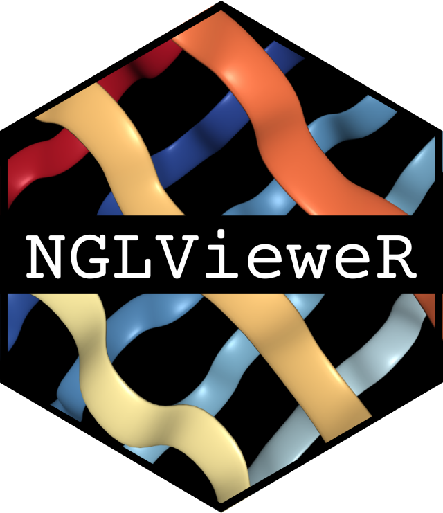

# **NGLVieweR** -  Visualize and interact with Protein Data Bank (PDB) and structural files in R and Shiny

<!-- badges: start -->

[](https://github.com/nvelden/NGLVieweR/actions) [](https://lifecycle.r-lib.org/articles/stages.html#experimental) [](https://CRAN.R-project.org/package=NGLVieweR)

<!-- badges: end -->

### [Click here](https://niels-van-der-velden.shinyapps.io/shinyNGLVieweR/) to view a Shiny application integrating most features of **NGLVieweR**.

## Description

**NGLvieweR** provides an R interface to the [NGL.js](http://nglviewer.org/ngl/api/) JavaScript library. It can be used to visualize and interact with protein data bank (PDB) and structural files in R and Shiny applications. It includes a set of API functions to manipulate the viewer after creation and makes it possible to retrieve data from the visualization into R.

## Installation

**NGLVieweR** is available through GitHub

``` {.r}
install.packages("remotes")
remotes::install_github("nvelden/NGLVieweR")
```

## Basics

You can load a PDB (or any other supported structural file) directly or use a PDB code of a structure on [RCSB.org](https://www.rcsb.org/). The below minimal example loads the PDB file and displays the structure in a "cartoon" representation.

``` {.r}
#Load local pdb file
NGLVieweR("C:/7CID.pdb") %>%
addRepresentation("cartoon")

#Load protein by PDB code
NGLVieweR("7CID") %>%
addRepresentation("cartoon")
```


## Functionality

There are functions provided to:

-   Overlay different representation styles
-   Alter the stage parameters (eg. background, zoom- and rotation speed)
-   Zoom to specific selections
-   Add labels
-   Add contacts between residues
-   Auto rotate/rock

In Shiny apps, you can manipulate the **NGLVieweR** widget after creation using specific "API"" calls. Users can for instance add/remove representations, make snapshots, add labels or highlight specific regions. See the [Get started](https://nvelden.github.io/NGLVieweR/articles/NGLVieweR.html) section for a complete overview.
