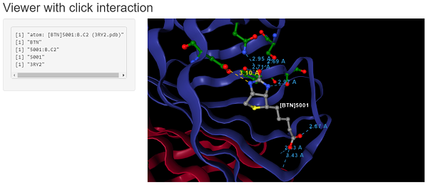

```{r setup, echo = FALSE, message = FALSE}
knitr::opts_chunk$set(tidy = FALSE, comment = "#>")
```

## Installation

**NGLVieweR** is available through GitHub

```{r eval=FALSE}
install.packages("remotes")
remotes::install_github("nvelden/NGLVieweR")
```

## Loading PDB files

You can load a PDB (or and other supported format) directly or use a PDB code of a structure on [RCSB.org](https://www.rcsb.org/). The below minimal example loads the PDB file and displays the structure in a "cartoon" representation.

```{r eval=FALSE}
#Load local pdb file
NGLVieweR("C:/7CID.pdb") %>%
addRepresentation("cartoon")
#Load protein by PDB code
NGLVieweR("7CID") %>%
addRepresentation("cartoon")
```

**Note:** Use mouse for selection (left-click), rotate/move (left/right-click hold) and zooming (scroll wheel).

```{r Loading, echo=FALSE, screenshot.force=FALSE}
library(NGLVieweR)
#Load local pdb file
NGLVieweR("7CID") %>%
addRepresentation("cartoon")
```

You can view a "basic" **NGLVieweR** Shiny application by running the below code. Use "API" for an example using API calls or any of the function names (e.g "addSelection"") for function specific examples.

```{r eval=FALSE}
library(NGLVieweR)
library(shiny)
NGLVieweR_example("basic") 
```

## Loading other structural files

This package has been developed and tested using PDB files but supports loading of any of the following structural files: .mmcif, .cif, .mcif, .ent, .pqr, .gro, .sdf, .sd, .mol2 and .mmtf.

By default **NGLVieweR** guesses the file format from the file extension. Use the `format` parameter in case no or the wrong file extension is provided.

```{r fileformat, screenshot.force=FALSE}

#Note that line formatting needs to be exact when reading from console!
benz <- "
702
  -OEChem-02271511112D
  9  8  0     0  0  0  0  0  0999 V2000
    0.5369    0.9749    0.0000 O   0  0  0  0  0  0  0  0  0  0  0  0
    1.4030    0.4749    0.0000 C   0  0  0  0  0  0  0  0  0  0  0  0
    2.2690    0.9749    0.0000 C   0  0  0  0  0  0  0  0  0  0  0  0
    1.8015    0.0000    0.0000 H   0  0  0  0  0  0  0  0  0  0  0  0
    1.0044    0.0000    0.0000 H   0  0  0  0  0  0  0  0  0  0  0  0
    1.9590    1.5118    0.0000 H   0  0  0  0  0  0  0  0  0  0  0  0
    2.8059    1.2849    0.0000 H   0  0  0  0  0  0  0  0  0  0  0  0
    2.5790    0.4380    0.0000 H   0  0  0  0  0  0  0  0  0  0  0  0
    0.0000    0.6649    0.0000 H   0  0  0  0  0  0  0  0  0  0  0  0
  1  2  1  0  0  0  0
  1  9  1  0  0  0  0
  2  3  1  0  0  0  0
  2  4  1  0  0  0  0
  2  5  1  0  0  0  0
  3  6  1  0  0  0  0
  3  7  1  0  0  0  0
  3  8  1  0  0  0  0
M  END
> <ID>
00001
> <DESCRIPTION>
Solvent produced by yeast-based fermentation of sugars.
$$$$
"
NGLVieweR(benz, format="sdf") %>%
  addRepresentation("ball+stick")
```

## Representations

You can load the structure as a "cartoon", "ball+stick", "line", "surface", "ribbon", or any other representation listed in the [NGL.js](http://nglviewer.org/ngl/api/) manual under "StructureRepresentation". Multiple representations of the same structure can be overlaid by chaining the `addSelection()` function. Also see the "structure" tab in the [demo](https://niels-van-der-velden.shinyapps.io/shinyNGLVieweR/) app for a list of possible representations.

```{r eval=FALSE}
NGLVieweR("7CID") %>%
addRepresentation("cartoon") %>%
addRepresentation("ball+stick")
```

You can alter the appearance of select residues using the `param` argument. For a full list of options see the [NGL.js](http://nglviewer.org/ngl/api/) "RepresentationParameters" and the "Selection language" section.

```{r representations, screenshot.force=FALSE}
NGLVieweR("7CID") %>%
  addRepresentation("cartoon",
    param = list(colorScheme = "residueindex")
  ) %>%
  addRepresentation("ball+stick",
    param = list(
      sele = "233-248",
      colorValue = "red",
      colorScheme = "element"
    )
  ) %>%
  addRepresentation("surface",
    param = list(
      colorValue = "white",
      opacity = 0.1
    )
  )
```

## Stage

You can alter the background color or set the zoom or rotation speed using the `stageParameters()` function. For a full list of options, see the "StageParameters" method in the official [NGL.js](http://nglviewer.org/ngl/api/) manual. In additions there are specific functions to set:

-   **Animation**: `setRock()` or `setSpin()`
-   **Focus**: `setFocus()`
-   **Quality**: `setQuality()`

**Note**: Changes in background color are not visible in the RStudio viewer.

```{r stage, screenshot.force=FALSE}
NGLVieweR("7CID") %>%
  stageParameters(backgroundColor = "white", zoomSpeed = 1) %>%
  addRepresentation("cartoon",
    param = list(name = "cartoon", colorScheme = "residueindex")
  ) %>%
  setSpin()
```

## Labels

Labels can be added by setting the `addRepresentation()` type parameter to "label". For a full list of of options, see the LabelRepresentationParameters section in the [NGL.js](http://nglviewer.org/ngl/api/) manual. Also see the "label" tab in the [demo](https://niels-van-der-velden.shinyapps.io/shinyNGLVieweR/) app for possible label settings.

```{r labels, screenshot.force=FALSE}
NGLVieweR("7CID") %>%
  addRepresentation("cartoon") %>%
  addRepresentation("ball+stick", param = list(
    colorScheme = "element",
    colorValue = "yellow",
    sele = "20"
  )) %>%
  addRepresentation("label",
    param = list(
      sele = "20",
      labelType = "format",
      labelFormat = "[%(resname)s]%(resno)s", # or enter custom text
      labelGrouping = "residue", # or "atom" (eg. sele = "20:A.CB")
      color = "white",
      fontFamiliy = "sans-serif",
      xOffset = 1,
      yOffset = 0,
      zOffset = 0,
      fixedSize = TRUE,
      radiusType = 1,
      radiusSize = 1.5, # Label size
      showBackground = FALSE
      # backgroundColor="black",
      # backgroundOpacity=0.5
    )
  )
```

## Zoom

You can zoom into specific residues using the `ZoomMove()` function.

```{r zoom, screenshot.force=FALSE}
NGLVieweR("7CID") %>%
  addRepresentation("cartoon") %>%
  addRepresentation("ball+stick",
    param = list(
      colorScheme = "element",
      colorValue = "yellow",
      sele = "20"
    )
  ) %>%
  addRepresentation("label",
    param = list(
      sele = "20",
      labelType = "format",
      labelFormat = "[%(resname)s]%(resno)s", # or enter custom text
      labelGrouping = "residue", # or "atom" (eg. sele = "20:A.CB")
      color = "white",
      xOffset = 1,
      fixedSize = TRUE,
      radiusType = 1,
      radiusSize = 1.5
    ) # Label size
  ) %>%
  zoomMove(
    center = "20",
    zoom = "20",
    duration = 0, # animation time in ms
    z_offSet = -20
  )
```

## Contact

Contacts between residues can be added by setting the `addRepresentation()` type parameter to "contact". Using the `sele` parameter contacts for specific residues can be selected. The `filterSele` parameter can be used to only show contacts between two selections. In the below example Biotin and residues 23, 27, 43, 45, and 128 are selected `sele="5001 or 23 or 27 or 43 or 45 or 128"` and contacts are only shown between the residues and biotin `filterSele=list("23 or 27 or 43 or 45 or 128", "5001")`. This prevents the display of contacts between residues or water molecules.

```{r contact, screenshot.force=FALSE}
NGLVieweR("3RY2") %>%
  addRepresentation("cartoon") %>%
  addRepresentation("ball+stick",
    param = list(
      name = "biotin",
      colorvalue = "grey",
      colorScheme = "element",
      sele = "5001"
    )
  ) %>%
  addRepresentation("ball+stick",
    param = list(
      name = "interacting",
      colorScheme = "element",
      colorValue = "green",
      sele = "23 or 27 or 43 or 45 or 128"
    )
  ) %>%
  zoomMove(
    center = "27:B",
    zoom = "27:B",
    z_offSet = -20
  ) %>%
  addRepresentation("contact",
    param = list(
      name = "contact",
      sele = "5001 or 23 or 27 or 43 or 45 or 128",
      filterSele = list("23 or 27 or 45 or 128", "5001"),
      labelVisible = TRUE,
      labelFixedSize = FALSE,
      labelUnit = "angstrom", # "", "angstrom", "nm"
      labelSize = 2
      # hydrogenBond=TRUE,
      # weakHydrogenBond=FALSE,
      # waterHydrogenBond=FALSE,
      # backboneHydrogenBond=TRUE,
      # hydrophobic=FALSE,
      # halogenBond=TRUE,
      # ionicInteraction=TRUE,
      # metalCoordination=TRUE,
      # cationPi=TRUE,
      # piStacking=TRUE,
      # maxHydrophobicDist= 4.0,
      # maxHbondDist= 3.5,
      # maxHbondSulfurDist= 4.1,
      # maxHbondAccAngle= 45,
      # maxHbondDonAngle= 45,
      # maxHbondAccPlaneAngle= 90,
      # maxHbondDonPlaneAngle= 30,
      # maxPiStackingDist= 5.5,
      # maxPiStackingOffset= 2.0,
      # maxPiStackingAngle= 30,
      # maxCationPiDist= 6.0,
      # maxCationPiOffset= 2.0,
      # maxIonicDist= 5.0,
      # maxHalogenBondDist= 3.5,
      # maxHalogenBondAngle= 30,
      # maxMetalDist= 3.0,
      # refineSaltBridges= TRUE,
      # masterModelIndex= -1,
      # lineOfSightDistFactor= 1
    )
  )
```

## Shiny

The `NGLVieweROutput()` and `renderNGLVieweR()` functions enable you to visualize PDB files within Shiny applications. See the `NGLVieweR_example("basic")` and "API" for live examples.

```{r eval=FALSE}
library(shiny)
library(NGLVieweR)
ui <- fluidPage(NGLVieweROutput("structure"))
server <- function(input, output) {
  output$structure <- renderNGLVieweR({
    NGLVieweR("7CID") %>%
      addRepresentation("cartoon",
        param = list(
          name = "cartoon", color =
            "residueindex"
        )
      ) %>%
      addRepresentation("ball+stick",
        param = list(
          name = "cartoon",
          sele = "1-20",
          colorScheme = "element"
        )
      ) %>%
      stageParameters(backgroundColor = "black") %>%
      setQuality("high") %>%
      setFocus(0) %>%
      setSpin(TRUE)
  })
}
shinyApp(ui, server)
```

```{r, echo=FALSE}
knitr::include_graphics("../man/figures/basic_shiny.PNG")
```

## API

In Shiny apps, you can manipulate the **NGLVieweR** widget after creation using specific "API" calls. You can for instance add or remove representations by referring to their name using the `addSelection()` or `removeSelection()` functions.

```{r eval=FALSE}
library(shiny)
library(NGLVieweR)
ui <- fluidPage(
  titlePanel("Viewer with API inputs"),
  sidebarLayout(
    sidebarPanel(
      textInput("selection", "Selection", "1-20"),
      selectInput("type", "Type", c("ball+stick", "cartoon", "backbone")),
      selectInput("color", "Color", c("orange", "grey", "white")),
      actionButton("add", "Add"),
      actionButton("remove", "Remove")
    ),
    mainPanel(
      NGLVieweROutput("structure")
    )
  )
)
server <- function(input, output) {
  output$structure <- renderNGLVieweR({
    NGLVieweR("7CID") %>%
      addRepresentation("cartoon",
        param = list(name = "cartoon", colorScheme = "residueindex")
      ) %>%
      stageParameters(backgroundColor = input$backgroundColor) %>%
      setQuality("high") %>%
      setFocus(0) %>%
      setSpin(TRUE)
  })
  observeEvent(input$add, {
    NGLVieweR_proxy("structure") %>%
      addSelection(isolate(input$type),
        param =
          list(
            name = "sel1",
            sele = isolate(input$selection),
            colorValue = isolate(input$color)
          )
      )
  })
  observeEvent(input$remove, {
    NGLVieweR_proxy("structure") %>%
      removeSelection("sel1")
  })
}
shinyApp(ui, server)
```

```{r, echo=FALSE}
knitr::include_graphics("../man/figures/API_shiny.PNG")
```

### Possible API functions are:

-   `addSelection()`
-   `removeSelection()`
-   `snapShot()`
-   `updateColor()`
-   `updateFocus()`
-   `updateFullscreen()`
-   `updateRepresentation()`
-   `updateRock()`
-   `updateSelection()`
-   `updateSpin()`
-   `updateStage()`
-   `updateVisibility()`
-   `updateZoomMove()`

## Retrieving data from the widget

In a Shiny application one can retrieve information from the widget as inputs based on the NGLVieweR `outputID`. Suppose the `outputID` is "structure", then the following information can be retrieved:

-   input\$structure_selection - Get details on the clicked residue.
-   input\$structure_sequence - will return the sequence of the PDB file as a character vector.
-   input\$structure_resno - will return all the sequence numbers as a numeric vector.
-   input\$structure_chainname - will return the chainname of each amino acid as a character vector,
-   input\$structure_rendering - will return `TRUE` if the widget is loading or `FALSE` when completed.
-   input\$structure_PDB - will return the PDB file as a text string.
-   input\$structure_selAround - will return a list of atoms surrounding a clicked residue.

In the below example a label, all contacts and residues in proximity of the clicked residue are displayed.

```{r eval=FALSE}
library(shiny)
library(NGLVieweR)
library(stringr)

# SEE: https://github.com/nglviewer/ngl/issues/615

ui <- fluidPage(
  titlePanel("Viewer with click interaction"),
  sidebarLayout(
    sidebarPanel(verbatimTextOutput('selection')),
    mainPanel(NGLVieweROutput("structure"))
  )
)

server <- function(input, output) {
  output$structure <- renderNGLVieweR({
    NGLVieweR("3RY2") %>%
      addRepresentation("cartoon") %>%
      addRepresentation(
        "ball+stick",
        param = list(
          name = "biotin",
          colorvalue = "grey",
          colorScheme = "element",
          sele = "5001"
        )
      ) %>%
      zoomMove(center = "27:B",
               zoom = "27:B",
               z_offSet = -20) %>%
      selectionParameters(3, "residue") #"atom"
  })
  
  #Save click selections
  sele <- reactiveValues()
  
  observe({
    sele$aa <-
      str_extract(input$structure_selection, "(?<=[\\[])(.*?)(?=\\])")
    sele$aa_bond <-
      str_extract(input$structure_selection, "(?<=[\\]])(.*?)(?=[:space:])")
    sele$resiChain <-
      str_extract(input$structure_selection, "(?<=[]])(.*?)(?=[.])")
    sele$resi <-
      str_extract(input$structure_selection, "(?<=[]])(.*?)(?=[:])")
    sele$fileName <-
      str_extract(input$structure_selection, "(?<=[(])(.*?)(?=[.])")
  })
  
  output$selection = renderPrint({
    #Full selection
    print(input$structure_selection)
    #Amino Acid
    print(sele$aa)
    #Bond
    print(sele$aa_bond)
    #Residue number + ChainNAme
    print(sele$resiChain)
    #Residue number
    print(sele$resi)
    #PDB name
    print(sele$fileName)
    #SelAround
    print(input$structure_selAround)
  })
  
  observeEvent(input$structure_selAround, {
    NGLVieweR_proxy("structure") %>% removeSelection("selAround")
    
    NGLVieweR_proxy("structure") %>%
      addSelection(
        "ball+stick",
        param =
          list(
            name = "selAround",
            sele = input$structure_selAround,
            colorValue = "grey"
          )
      )
    
  })
  
  observeEvent(sele$resiChain, {
    #Remove any selections
    NGLVieweR_proxy("structure") %>% removeSelection("label")
    NGLVieweR_proxy("structure") %>% removeSelection("contact")
    
    #Add label and contacts
    NGLVieweR_proxy("structure") %>%
      
      addSelection(
        "label",
        param = list(
          name = "label",
          sele = sele$resiChain,
          labelType = "format",
          labelFormat = "[%(resname)s]%(resno)s",
          # or enter custom text
          labelGrouping = "residue",
          # or "atom" (eg. sele = "20:A.CB")
          color = "white",
          xOffset = 1,
          fixedSize = TRUE,
          radiusType = 1,
          radiusSize = 1.5
        )
      ) %>%
      addSelection(
        "contact",
        param = list(
          name = "contact",
          sele = "*",
          #Select all residues
          filterSele =
            list(sele$resiChain, # Show bonds between selected residue
                 "*"),
          # and all other residues
          labelVisible = TRUE,
          labelFixedSize = FALSE,
          labelUnit = "angstrom",
          # "", "angstrom", "nm"
          labelSize = 2
        )
      )
  })
  
}
shinyApp(ui, server)
```

```{r, echo=FALSE}

```